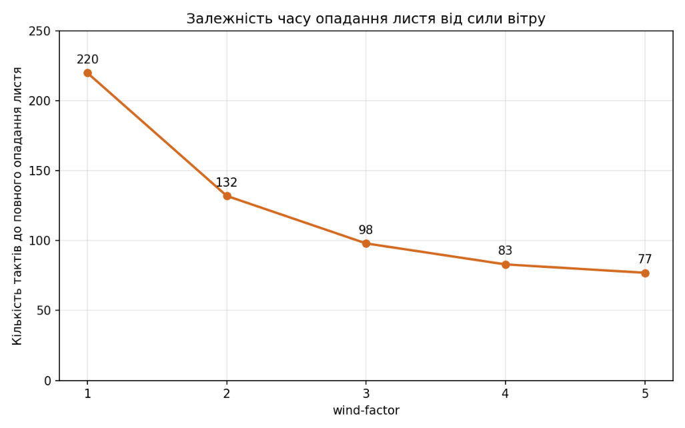
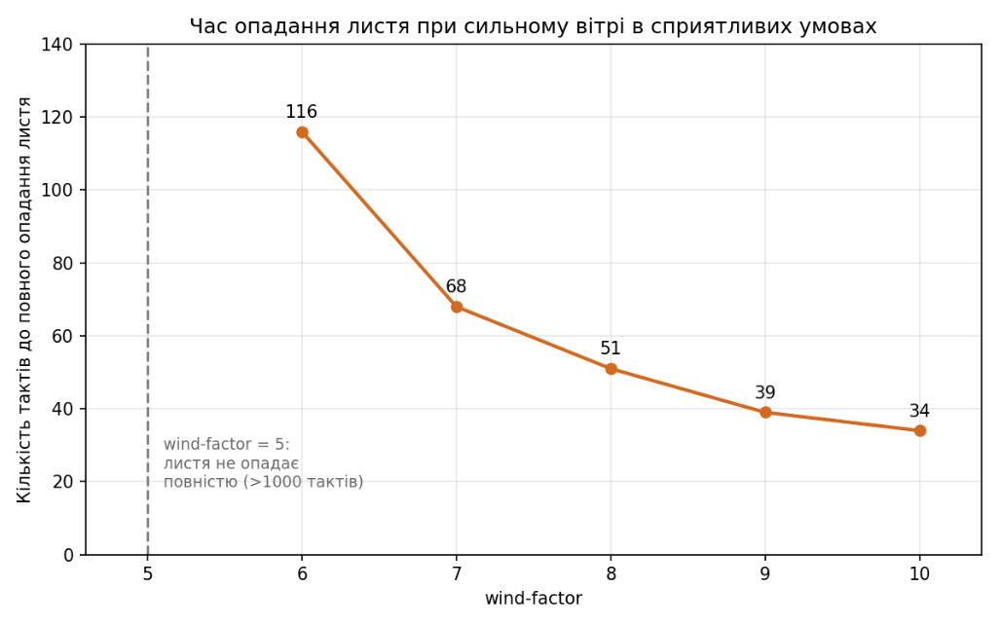
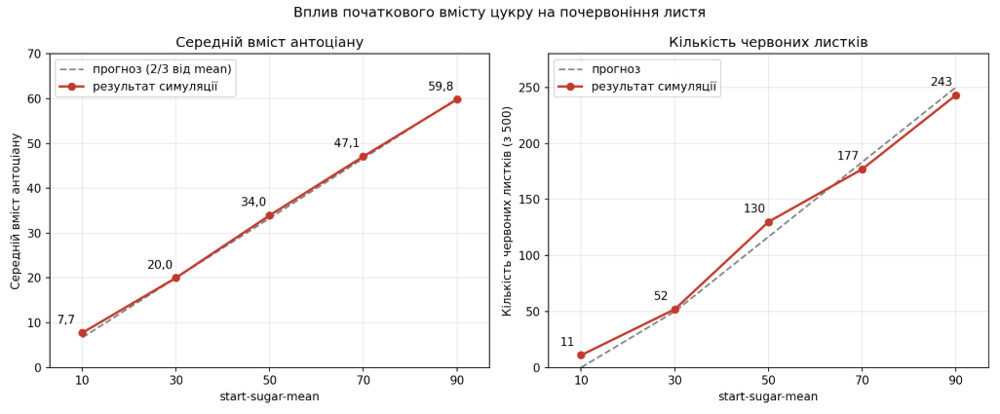

# Комп'ютерні системи імітаційного моделювання
# СПм-25-1, Олешко Владислав Миколайович

## Лабораторна робота №1. Опис імітаційних моделей та проведення обчислювальних експериментів

## Варіант 11. Модель у середовищі NetLogo - Autumn

### Вербальний опис моделі:
Симуляцію впливу осінньої пори року на листя дерев. Модель дозволяє побачити як вони змінюються від свого типового для теплої пори року стану до жовтого й врешті опадають з дерев під дією різних погодних умов притаманних для осені.

### Керуючі параметри:
**number-of-leaves**: визначає стартову кількість агентів у середовищі моделювання -> в обраній моделі це задає кількість листя на дереві у симуляції.

**start-sugar-mean**: визначає важливу характеристику агента на старті -> в обраній моделі це середній вміст цукру у кожному окремому листочку дерева.

**start-sugar-stddev**: визначає стандартне відхилення параметру вище -> в обраній моделі це контролює наскільки різними можуть бути агенти (листочки) за вмістом цукру. Тобто або листочки будуть мати приблизно однакову кількість цукру (за меншого показника) або ж деякі матимуть багато, а деякі майже нічого (за вищого показника).

**temperature**: визначає температуру повітря (у Цельсіях) -> в обраній моделі це головний осінній чинник, що впливає одразу на кілька процесів: нижче 20 градусів листок перетворює цукор і воду на антоціан (червоніє); нижче 15 градусів руйнується хлорофіл, чим холодніше - тим швидше; нижче 10 градусів листок перестає поглинати воду, а вище 30 градусів вода з листка випаровується.

**rain-intensity**: визначає інтенсивність опадів -> в обраній моделі це кількість крапель дощу, що з'являються на кожному такті (кожна несе 10 одиниць води). Краплі падають на землю, через коріння та стовбур піднімаються до крони і розходяться між листками; листок поглинає 20% води найближчої краплі (від центру 0,0).

**wind-factor**: визначає силу вітру -> в обраній моделі це величина, на яку на кожному такті зменшується прикріпленість кожного листка. Також визначає наскільки сильно листок зносить убік під час падіння і як швидко він падає.

**sun-intensity**: визначає інтенсивність сонячного освітлення (у відсотках) -> в обраній моделі при значенні понад 20% вмикаються фотосинтез і відновлення хлорофілу. Але понад 75% інтенсивності руйнує хлорофіл, тим сильніше чим яскравіше сонце. Візуально відображається розміром і кольором сонця.

### Внутрішні параметри:
**water-level**: запас води в листку, на старті 75–100. Поповнюється з крапель дощу (лише при температурі від 10 градусів), витрачається на фотосинтез (0,5 за такт) та утворення антоціану (1 за такт), випаровується при температурі понад 30. Якщо води менше 25 - листок слабне (прикріпленість −1 за такт); якщо менше 1 - листок одразу відривається.
**sugar-level**: запас цукру в листку, на старті генерується за нормальним розподілом з параметрами start-sugar-mean та start-sugar-stddev. Збільшується на 1 при фотосинтезі, витрачає 0,5 кожен такт на підтримку життєдіяльністі та 1 при утворенні антоціану.
**attachedness**: прикріпленість листка до дерева, на старті 100–150. Зменшується кожен такт на wind-factor та на 1 при нестачі води, збільшується на 5 при фотосинтезі. Коли значення досягає 0, листок падає.
**chlorophyll**: вміст хлорофілу (зелений пігмент), на старті 50–100. Руйнується при температурі нижче 15, при сонці понад 75% та при фотосинтезі (0,5 за такт); відновлюється на 1 за такт при температурі понад 15 та сонці понад 20%.
**carotene**: вміст каротину (жовтий пігмент), задається випадково в межах 0–99 і не змінюється протягом симуляції. Стає помітним, коли хлорофілу стає менше 50.
**anthocyanin**: вміст антоціану (червоний пігмент), на старті 0. Збільшується на 1 за такт при температурі нижче 20 °C, якщо в листку є цукор і вода.

Колір листка визначається так: якщо хлорофілу більше 50 - листок зелений. Інакше порівнюються антоціан і каротин. Якщо вони відрізняються менше ніж на 10 - листок помаранчевий, а якщо переважає антоціан — червоний, якщо каротин — жовтий.

### Алгоритм зміни станів моделі:
1. Якщо не залишилось жодного неопалого листка - симуляція зупиняється.
2. Коли є вітер - листки трохи повертаються, прикріпленість кожного зменшується на wind-factor.
3. Падає дощ - з'являються rain-intensity нових крапель, усі краплі рухаються вниз.
4. Вода від дощу рухається - краплі, що впали на траву, через коріння йдуть до стовбура, потім до центру крони, а звідти розходяться у випадкових напрямках між листками. Краплі, що віддали майже всю воду або вийшли за межі крони, зникають.
5. Кожен прикріплений листок поглинає воду, оновлює рівень хлорофілу, проводить фотосинтез, утворює антоціан (за низької температури) та змінює колір.
6. Листки з нульовою прикріпленістю падають донизу, а ті що досягли землі - стають опалими.
7. Листки, у яких майже не залишилось води, відриваються.
8. Значення внутрішніх параметрів обмежуються діапазоном 0–100 перед початком симуляції.

### Показники роботи системи:
- кількість неопалих та опалих листків на поточному такті (графік Leaves).
- поточні значення погодних умов: температура, інтенсивність дощу, сила вітру та освітленість (графік Weather conditions).
- середні по всіх листках значення хлорофілу, води, цукру, каротину, антоціану та прикріпленості (графік Leaf averages).
- кількість тактів до повного опадання листя: у цей момент симуляція зупиняється автоматично.

### Примітки:
Параметри number-of-leaves, start-sugar-mean та start-sugar-stddev впливають лише на початковий стан моделі і застосовуються при натисканні setup. Параметри погоди діють на кожному такті і можуть змінюватись під час симуляції. Параметр leaf-display-mode змінює лише спосіб відображення листків і не впливає на поведінку моделі.

Оскільки значення обрізаються до 0–100, при великому start-sugar-stddev частина листків після першого такту матиме рівно 0 або 100 одиниць цукру.

Фотосинтез додає листку 5 одиниць прикріпленості за такт, тому поки він триває і води достатньо вітер силою до 5 не здатен зірвати листок. Масове опадання починається коли фотосинтез припиняється (сонце 20% і менше, вичерпано хлорофіл або воду) або при сильнішому вітрі.

При яскравому сонці хлорофіл руйнується дуже швидко: при 97% він втрачає понад 10 одиниць за такт, тож дерево втрачає зелений колір за кілька тактів.

### Недоліки моделі:
- Модель досить спрощено описує обмін речовин: єдиним джерелом води є дощ, з однієї краплі можуть пити кілька листків, а цукор не переміщується між листками і не запасається в коренях. У моделі немає зміни сезонів чи доби: погода не змінюється, доки її не змінить користувач, тому настання осені доводиться імітувати вручну.
- Початкова прикріпленість задається в межах 100–150, але вже після першого такту обрізається до 100, тож цей розкид фактично не має сенсу.
- Утворення антоціану залежить лише від порогу температури, а не від концентрації цукру, як стверджується в описі моделі.
- При температурі нижче 10 градусів процедура обробки води завершується одразу, тому пропускається перевірка нестачі води (послаблення листка при рівні нижче 25).
- Коментар у коді стверджує, що цукор кожен такт зменшується на 1, хоча фактично він зменшується на 0,5.

## Обчислювальні експерименти
### 1. Вплив інтенсивності вітру на опадання листя
Досліджується залежність фактору вітру на опадіння листя. Очікується, що сильніший вітер має швидше призвести до повного опадіння листя. Вхідні показники: кількість агентів (листя) - 500, інтенсивність сонячного освітлення - 70, інші показники не змінюються. wind-factor зростає на 1 при кожній наступній симуляції. Очікується, що при збільшенні wind-factor кількість тактів симуляції зменшується, бо раніше досягається умова зупинки.
<table>
<thead>
<tr><th>wind-factor</th><th>Кількість тактів до повного опадання листя</th></tr>
</thead>
<tbody>
<tr><td>1</td><td>220</td></tr>
<tr><td>2</td><td>132</td></tr>
<tr><td>3</td><td>98</td></tr>
<tr><td>4</td><td>83</td></tr>
<tr><td>5</td><td>77</td></tr>
</tbody>
</table>

### 2. Вплив інтенсивності вітру на опадання листя за наближених до ідеалу інших умов
В основі цього дослідження також вплив вітру, але цього разу інші показники будуть виставлені максимально ідеальні й відповідно мають іноді компенсувати фактор вітру або щонайменше значно подовжувати життя листя. Отже, wind-factor буде змінюватись від 5 до 10 на кожній симуляції, temperature - 25, rain-intensity - 30 (max), sun-intensity - 50.

<table>
<thead>
<tr><th>wind-factor</th><th>Кількість тактів до повного опадання листя</th></tr>
</thead>
<tbody>
<tr><td>5</td><td>&gt; 1000 (≈140 листків не опало)</td></tr>
<tr><td>6</td><td>116</td></tr>
<tr><td>7</td><td>68</td></tr>
<tr><td>8</td><td>51</td></tr>
<tr><td>9</td><td>39</td></tr>
<tr><td>10</td><td>34</td></tr>
</tbody>
</table>

Поки триває фотосинтез, прикріпленість листка кожен такт збільшується на 5 і зменшується на значення wind-factor. Тому значення 5 є граничним: при ньому вітер лише компенсує фотосинтез. Близько 360 листків все ж опали протягом перших ~200 тактів, але решта (~140) трималась до кінця симуляції. Листки що залишились, зосереджені в центрі крони: вода від стовбура надходить саме туди і не встигає дійти до периферії, тому крайні листки страждають від її нестачі (рівень води нижче 25 зменшує прикріпленість ще на 1 за такт).

При wind-factor понад 5 прикріпленість зменшується на (wind-factor: 5) за такт, і все листя опадає. Як і в першому експерименті, залежність нелінійна: кожне наступне посилення вітру скорочує час опадання дедалі менше.

### 3. Вплив початкового вмісту цукру на почервоніння листя
Досліджую чи залежить почервоніння листя від початкового запасу цукру. За холоду (нижче 20 градусів) листок кожен такт перетворює 1 одиницю цукру на 1 одиницю антоціану і ще 0,5 цукру витрачає на життєдіяльність. Якщо вимкнути фотосинтез, нового цукру не буде, тому кожен листок накопичить антоціану приблизно 2/3 від початкового цукру. Припущення полягає у тому що залежність середнього антоціану від start-sugar-mean лінійна, і з більшим цукром дерево стає червонішим.
start-sugar-mean буде змінюватись у діапазоні 10-90 з кроком 20. start-sugar-stddev буде 10, щоб зменшити розкид значень, temperature - 12, щоб антоціан вироблявся, а вода надалі циркулювала. sun-intensity - 20, щоб зупинити фотосинтез. wind-factor - 0, щоб виключити вплив вітру. rain-intensity - 30 (max), щоб води завжди було вдосталь. number-of-leaves - 500 (як і в попередніх дослідженнях).

<table>
<thead>
<tr><th>start-sugar-mean</th><th>Середній антоціан (прогноз)</th><th>Середній антоціан (симуляція)</th><th>Червоних листків (прогноз)</th><th>Червоних листків (симуляція)</th></tr>
</thead>
<tbody>
<tr><td>10</td><td>6,7</td><td>7,74</td><td>0</td><td>11</td></tr>
<tr><td>30</td><td>20,0</td><td>20,03</td><td>50</td><td>52</td></tr>
<tr><td>50</td><td>33,3</td><td>33,97</td><td>117</td><td>130</td></tr>
<tr><td>70</td><td>46,7</td><td>47,10</td><td>183</td><td>177</td></tr>
<tr><td>90</td><td>60,0</td><td>59,83</td><td>250</td><td>243</td></tr>
</tbody>
</table>

Результати симуляції майже точно збігаються з теоретичним прогнозом: середній вміст антоціану лінійно зростає зі збільшенням початкового цукру, а кількість червоних листків зростає разом із ним. Отже, за холодної погоди саме запас цукру визначає, наскільки червоним стане листя - чим більше цукру листок накопичив, тим довше він може виробляти червоний пігмент.
